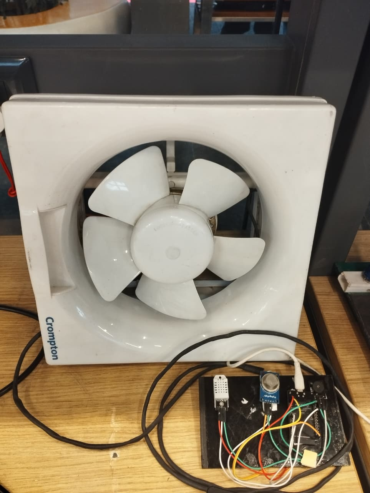
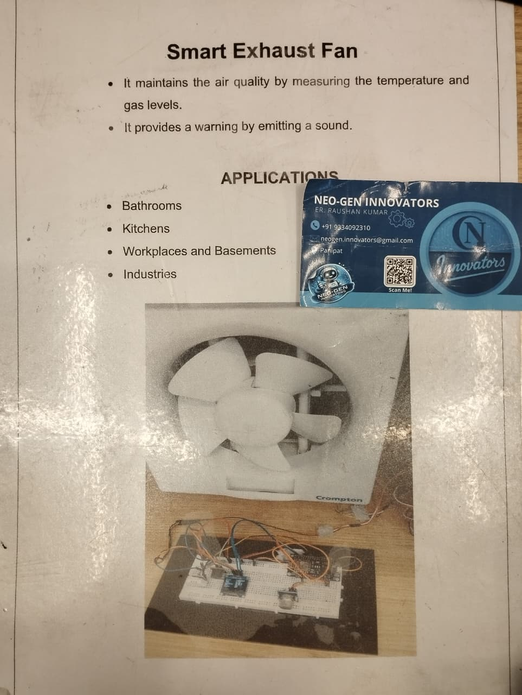

# 🌬️ Smart Exhaust Fan

An **IoT-based Smart Exhaust Fan** developed using **ESP32**, **DHT22**, and **MQ-2 Gas Sensor** to automatically maintain indoor air quality. The system continuously monitors temperature and gas concentration, activates the exhaust fan when unsafe conditions are detected, and triggers a buzzer to provide an instant warning, ensuring a safer and healthier environment.

---

## 📸 Project Preview

<p align="center">
  
  <br>
  <em>Smart Exhaust Fan Hardware Prototype Setup</em>
</p>

<p align="center">
  
  <br>
  <em>Project Overview Poster</em>
</p>

> **Prototype of the ESP32-based Smart Exhaust Fan demonstrating automatic ventilation using temperature and gas sensing.**


---

## ✨ Features

- 🌡️ Real-time temperature monitoring
- 💨 Harmful gas detection
- 🌬️ Automatic exhaust fan control
- 🚨 Instant buzzer alert during unsafe conditions
- ⚡ ESP32-based automation
- 🔋 Energy-efficient operation
- 💰 Low-cost and easy-to-build solution

---

## 🛠️ Hardware Components

- ESP32 Development Board
- DHT22 Temperature & Humidity Sensor
- MQ-2 Gas Sensor
- Relay Module
- Exhaust Fan
- Active Buzzer
- Breadboard
- Jumper Wires
- 5V Power Supply

---

## ⚙️ Working Principle

1. The ESP32 continuously reads temperature from the DHT22 sensor.
2. The MQ-2 sensor monitors the surrounding gas concentration.
3. Both readings are compared against predefined threshold values.
4. If either the temperature or gas concentration exceeds the safe limit:
   - The relay switches ON the exhaust fan.
   - The buzzer activates to alert nearby users.
5. Once the readings return to safe levels:
   - The exhaust fan automatically turns OFF.
   - The buzzer stops.

---

## 📂 Project Structure

```text
smart-exhaust-fan/
│
├── code/
│   └── Smart Exhaust System.docx   # Project report and Arduino source code details
│
├── images/
│   ├── 1.jpeg                      # Project poster with overview & applications
│   └── 2.jpeg                      # Smart Exhaust Fan hardware prototype setup
│
├── video/
│   └── demo.mp4                    # Complete working demonstration video
│
└── README.md                       # Project documentation and setup guide
```

---

## 🚀 Applications

- 🏠 Bathrooms
- 🍳 Kitchens
- 🏢 Workplaces
- 🧪 Laboratories
- 🏭 Industries
- 🏢 Basements
- 🌿 Indoor Air Quality Monitoring

---

## 🔮 Future Improvements

- 📱 Mobile application integration
- ☁️ Cloud data logging
- 📊 Air Quality Index (AQI) monitoring
- 🌐 Wi-Fi-based remote monitoring
- 🎛️ Automatic fan speed control (PWM)
- 📈 Real-time dashboard for sensor visualization

---

## 🎥 Project Demo

Watch the complete working demonstration of the Smart Exhaust Fan here:

**🔗 Demo Video:**  
https://drive.google.com/file/d/1ESLshh9JCNRN90SgC6f9OVH8HEg_fBzS/view?usp=sharing

> A downloadable copy of the demonstration video is also available in the `video/demo.mp4` file of this repository.

---

## 📄 Documentation

The complete project report, circuit diagrams, and technical details are documented in the `code/Smart Exhaust System.docx` file. Additional reference images and the demo video are available in their respective folders (`images/` and `video/`).

---
